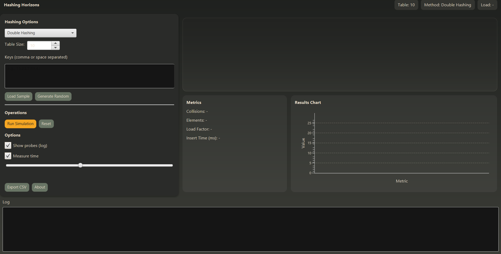
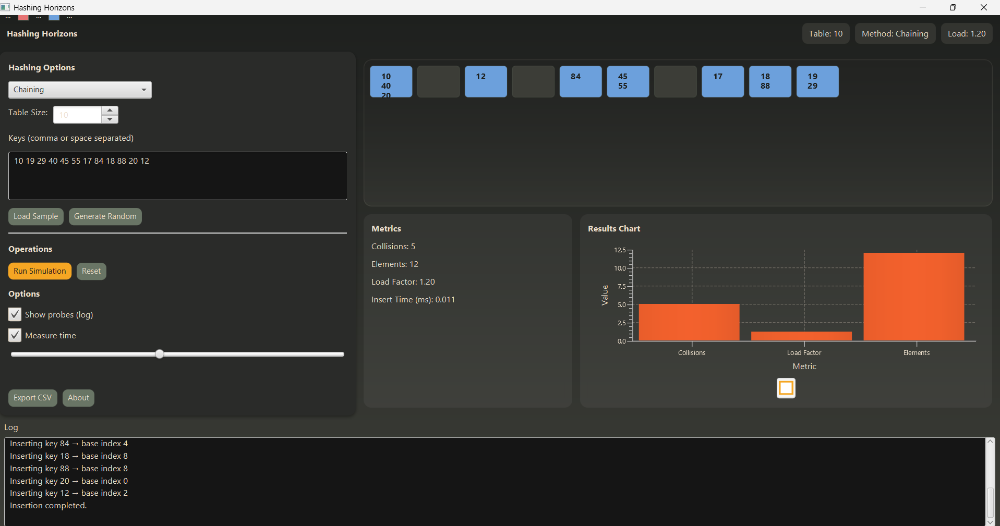
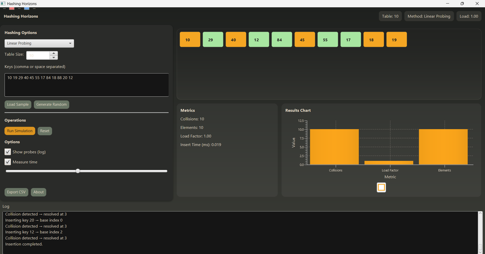
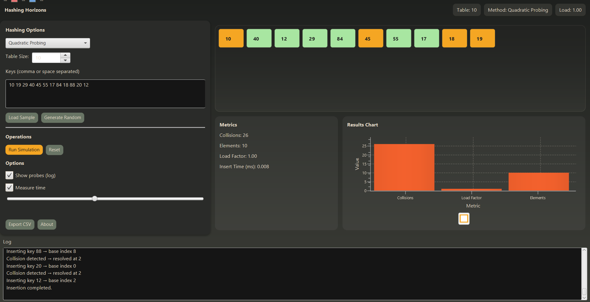

## Hashing Horizons – A Visual Hashing Simulator

A modern and interactive tool to visualize how hashing works using different collision handling techniques such as Chaining, Linear Probing, Quadratic Probing, and Double Hashing.

This project helps students, developers, and educators understand how data is stored in hash tables, how collisions occur, and how different methods resolve them.

# Features
1. Hashing Technique Visualization

* Shows color-coded blocks representing memory slots

* Displays how keys are inserted step-by-step

* Animates the probing sequence

* Displays key values inside blocks

2. Multiple Collision Handling Techniques

* Chaining * Linear Probing * Quadratic Probing * Double Hashing

3. Real-Time Metrics Display

* Collisions * Elements inserted * Load Factor * Insertion Time

4. Live Results Chart

* Bar chart showing * Collisions * Load Factor * Elements

5. Configurable Inputs

* Change table size * Provide comma/space-separated keys * Generate random keys * Load sample key set

6. Optional Logging

“Show Probes” → displays probing path

“Measure Time” → calculates insertion speed

7. Export to CSV

* Save metrics into a CSV file.

# Screenshots

# Hashing UI

# Chaining

# Linear Probing

# Quadratic Probing

# Double Hashing

# Technology Stack
Component	Technology
Language	Java 17+
UI Framework	JavaFX 20+
Build Tool	Maven
Charts	JavaFX BarChart
Animation	JavaFX FadeTransition
Platform	Desktop App (Windows/Mac/Linux)
# How to Run the Project
Option A – Run via Maven (Recommended for Development)
1. Make sure Java 17+ is installed

Verify with:

java -version

2. Run using Maven
mvn clean javafx:run

This will:

Compile your code

Run the JavaFX application

# Understanding the Visualization
✔ Color Codes
Color	Meaning
🟨 Yellow	Base index (initial hash position)
🟥 Red	Collision occurred here
🟩 Green	Final index where key was inserted
🟦 Blue	Chaining bucket index
🧠 Concept Explanations (For Viva)
# What is Hashing?

Hashing is a technique used to map data to a fixed-size memory (hash table) using a function called a hash function.

# What is Chaining?

Chaining stores multiple elements in the same index using a linked list.

No shifting

No full table issue

More memory usage

# Linear Probing

If a collision happens:

Try next index → i+1 → i+2 → i+3 → ...

Easy but causes primary clustering.

# Quadratic Probing

Instead of linear steps:

i + 1², i + 2², i + 3² ...

Avoids clustering but may skip slots.

# Double Hashing

Uses two hash functions:

index = h1(key) + i * h2(key)

Best at reducing clustering.

# What Does the Chart Represent?

The bar chart shows:

Total collisions

Load factor (how full table is)

Number of elements inserted

It helps compare performance between hashing techniques.

# Load Factor Meaning (Top Right Corner)
Load Factor = elements / table size

Example:

15 slots

13 elements
→ Load = 0.87

Higher load = more collisions.

# What Does the Slider Do?

The slider controls the speed of animation during insertion:

Left → slower

Right → faster

Useful for presentations.

# Table Block Explanation

Each block represents a memory index in the hash table.

Each block displays:

Index color (probe state)

Final stored key (number)

Tooltip with details

# License

MIT License (modify if needed)

# Author

Vansh Pratap Singh
Hashing Visualizer for DAA (Design and Analysis of Algorithms)
